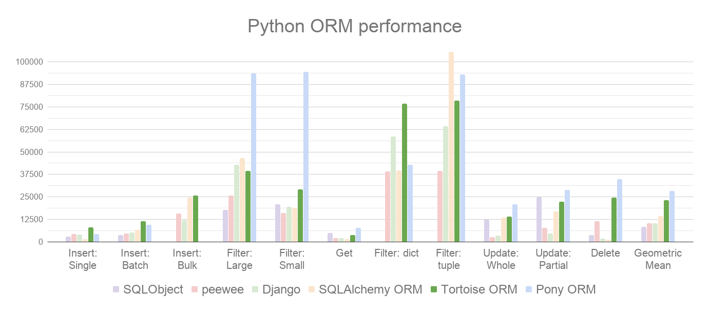

============
Tortoise ORM
============

Tortoise ORM is an easy-to-use ``asyncio`` ORM *(Object Relational Mapper)* inspired by Django.

Tortoise ORM was build with relations in mind and admiration for the excellent and popular Django ORM.
It's engraved in it's design that you are working not with just tables, you work with relational data.

.. note::
   Tortoise ORM is young project and breaking changes are to be expected.
   We keep a :ref:`changelog` and it will have possible breakage clearly documented.

Source & issue trackers are available at `<https://github.com/tortoise/tortoise-orm/>`_

Tortoise ORM is supported on CPython >= 3.7 for SQLite, MySQL and PostgreSQL.

Introduction
============

Why was Tortoise ORM built?
---------------------------

Python has many existing and mature ORMs, unfortunately they are designed with an opposing paradigm of how I/O gets processed.
``asyncio`` is relatively new technology that has a different concurrency model, and the largest change is regarding how I/O is handled.

However, Tortoise ORM is not first attempt of building ``asyncio`` ORM, there are many cases of developers attempting to map synchronous python ORMs to the async world, initial attempts did not have a clean API.

Hence we started Tortoise ORM.

Tortoise ORM is designed to be functional, yet familiar, to ease the migration of developers wishing to switch to ``asyncio``.

It also performs well when compared to other Python ORMs, trading places with Pony ORM:

How is an ORM useful?
---------------------

When you build an application or service that uses a relational database, there is a point when you can't just get away with just using parametrized queries or even query builder, you just keep repeating yourself, writing slightly different code for each entity.
Code has no idea about relations between data, so you end up concatenating your data almost manually.
It is also easy to make a mistake in how you access your database, making it easy for SQL-injection attacks to occur.
Your data rules are also distributed, increasing the complexity of managing your data, and even worse, is applied inconsistently.

An ORM (Object Relational Mapper) is designed to address these issues, by centralizing your data model and data rules, ensuring that your data is managed safely (providing immunity to SQL-injection) and keeps track of relationships so you don't have to.

Features
========

Clean, familiar python interface
--------------------------------
Define your models like so:

.. code-block:: python3

    from tortoise.models import Model
    from tortoise import fields

    class Tournament(Model):
        id = fields.IntField(pk=True)
        name = fields.TextField()

Initialise your models and database like so:

.. code-block:: python3

    from tortoise import Tortoise, run_async

    async def init():
        # Here we create a SQLite DB using file "db.sqlite3"
        #  also specify the app name of "models"
        #  which contain models from "app.models"
        await Tortoise.init(
            db_url='sqlite://db.sqlite3',
            modules={'models': ['app.models']}
        )
        # Generate the schema
        await Tortoise.generate_schemas()

    # run_async is a helper function to run simple async Tortoise scripts.
    run_async(init())

And use it like so:

.. code-block:: python3

    # Create instance by save
    tournament = Tournament(name='New Tournament')
    await tournament.save()

    # Or by .create()
    await Tournament.create(name='Another Tournament')

    # Now search for a record
    tour = await Tournament.filter(name__contains='Another').first()
    print(tour.name)

Pluggable Database backends
---------------------------
Tortoise ORM currently supports the following :ref:`databases`:

* PostgreSQL >= 9.4 (using ``asyncpg``)
* SQLite (using ``aiosqlite``)
* MySQL/MariaDB (using ``aiomysql``)

And more
--------

Tortoise ORM supports the following features:

* Designed to be used in an existing project:
    * Testing framework uses existing Python Unittest framework, just requires
      that ``initializer()`` and ``finalizer()`` gets called to set up and tear
      down the test databases. (See :ref:`unittest`)
    * ORM :ref:`init_app` configures entirely from provided parameters
* Composable, Django-inspired :ref:`models`
* Supports relations, such as ``ForeignKeyField`` and ``ManyToManyField``
* Supports many standard :ref:`fields`
* Comprehensive :ref:`query_api`
* Transactions :ref:`transactions`
* :ref:`pylint`

If you want to contribute check out issues, or just straightforwardly create PR
