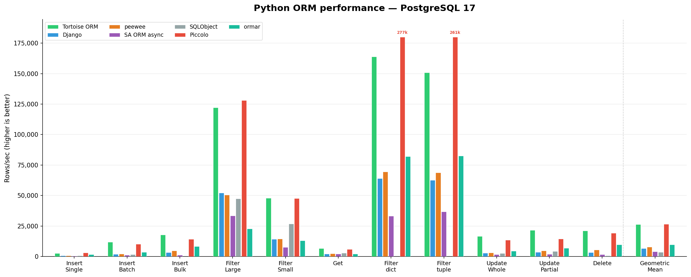

============
Tortoise ORM
============

Tortoise ORM is an easy-to-use ``asyncio`` ORM *(Object Relational Mapper)* inspired by Django.

.. note::
   Tortoise ORM is a young project and breaking changes are to be expected.
   We keep a `Changelog <https://tortoise.github.io/CHANGELOG.html>`_ and it will have possible breakage clearly documented.

Source & issue trackers are available at `<https://github.com/tortoise/tortoise-orm/>`_

Tortoise ORM is supported on CPython >= 3.9 for SQLite, MySQL and PostgreSQL and Microsoft SQL Server and Oracle.

Introduction
============

Why was Tortoise ORM built?
---------------------------

Python has many existing and mature ORMs, unfortunately they are designed with an opposing paradigm of how I/O gets processed.
``asyncio`` is relatively new technology that has a different concurrency model, and the largest change is regarding how I/O is handled.

However, Tortoise ORM is not first attempt of building ``asyncio`` ORM, there are many cases of developers attempting to map synchronous python ORMs to the async world, initial attempts did not have a clean API.

Hence we started Tortoise ORM.

Tortoise ORM is designed to be functional, yet familiar, to ease the migration of developers wishing to switch to ``asyncio``.

It also performs well when compared to other Python ORMs. In `our benchmarks <https://github.com/tortoise/orm-benchmarks>`_, where we measure different read and write operations (rows/sec, more is better), it's trading places with Pony ORM:

How is an ORM useful?
---------------------

When you build an application or service that uses a relational database, there is a point where you can't get away with just using parameterized queries or even query builder. You just keep repeating yourself, writing slightly different code for each entity.
Code has no idea about relations between data, so you end up concatenating your data almost manually.
It is also easy to make mistakes in how you access your database, which can be exploited by SQL-injection attacks.
Your data rules are also distributed, increasing the complexity of managing your data, and even worse, could lead to those rules being applied inconsistently.

An ORM (Object Relational Mapper) is designed to address these issues, by centralizing your data model and data rules, ensuring that your data is managed safely (providing immunity to SQL-injection) and keeps track of relationships so you don't have to.
An ORM (Object Relational Mapper) is designed to address these issues, by centralising your data model and data rules, ensuring that your data is managed safely (providing immunity to SQL-injection) and keeping track of relationships so you don't have to.

Features
========

Clean, familiar python interface
--------------------------------
Define your models:

.. code-block:: python3

    from tortoise.models import Model
    from tortoise import fields

    class Tournament(Model):
        id = fields.IntField(primary_key=True)
        name = fields.TextField()

Initialise your models and the database:

.. code-block:: python3

    from tortoise import Tortoise, run_async

    async def init():
        # Here we connect to a SQLite DB file.
        # also specify the app name of "models"
        # which contain models from "app.models"
        await Tortoise.init(
            db_url='sqlite://db.sqlite3',
            modules={'models': ['app.models']}
        )
        # Generate the schema
        await Tortoise.generate_schemas()

    # run_async is a helper function to run simple async Tortoise scripts.
    run_async(init())

Create instances of the models and query them:

.. code-block:: python3

    # Create instance by save
    tournament = Tournament(name='New Tournament')
    await tournament.save()

    # Or by .create()
    await Tournament.create(name='Another Tournament')

    # Now search for a record
    tour = await Tournament.filter(name__contains='Another').first()
    print(tour.name)

See :ref:`getting_started` for a more detailed guide.

Pluggable Database backends
---------------------------
Tortoise ORM currently supports the following :ref:`databases`:

* `PostgreSQL` >= 9.4 (using ``asyncpg``)
* `SQLite` (using ``aiosqlite``)
* `MySQL`/`MariaDB` (using `asyncmy <https://github.com/long2ice/asyncmy>`_)
* `Microsoft SQL Server`/`Oracle` (using ``asyncodbc``)

And more
--------

Tortoise ORM supports the following features:

* Composable, Django-inspired :ref:`models`
* Supports relations, such as ``ForeignKeyField`` and ``ManyToManyField``
* Supports many standard :ref:`fields`
* Comprehensive :ref:`query_api`
* Transactions :ref:`transactions`
* Supports tests frameworks, see :ref:`contrib_unittest`
* :ref:`pylint`

If you want to contribute, check out issues first, and then create a PR.
